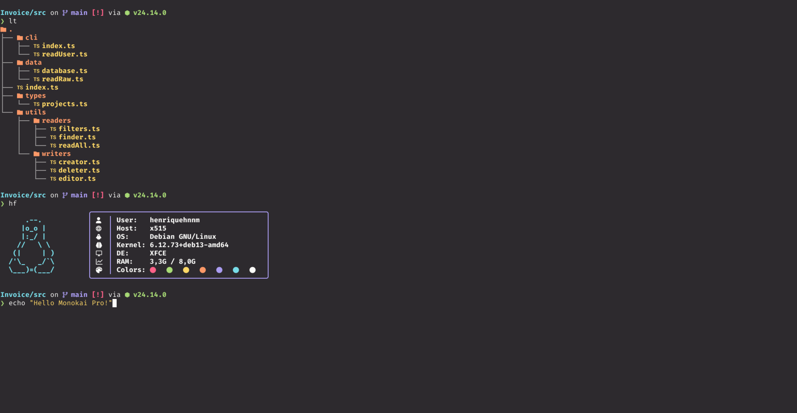

# Monokai Pro (CE) for [Xfce Terminal](https://docs.xfce.org/apps/xfce4-terminal/start)

## About this theme

This Monokai Pro Community Edition (CE) theme is maintained by [Henriquehnnm](https://github.com/Henriquehnnm) and is based on the original [Monokai Pro](https://monokai.pro) theme.

[Installation instructions](INSTALL.md)

[MIT License](LICENSE.md)

## Monokai Pro for more apps

